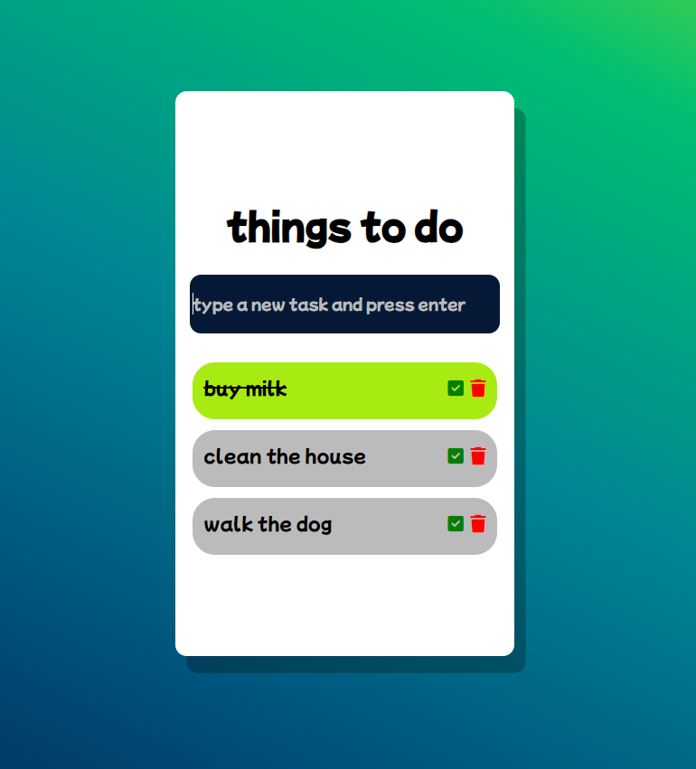

# To-Do List Project

Welcome to the To-Do List project! This simple web application allows you to create and manage your to-do list. You can add tasks, mark them as done, or delete them as needed. This project is built using jQuery for interactivity and basic CSS for styling.



## Table of Contents

- [Features](#features)
- [Prerequisites](#prerequisites)
- [Installation](#installation)
- [Usage](#usage)
- [Contributing](#contributing)
- [License](#license)

## Features

- Add new tasks to your to-do list.
- Mark tasks as done when you've completed them.
- Delete tasks you no longer need.
- Simple and intuitive user interface.

## Prerequisites

To run this project locally, you will need the following:

- A web browser (e.g., Google Chrome, Mozilla Firefox)
- A text editor or code editor (e.g., Visual Studio Code, Sublime Text)

## Installation

1. Clone the GitHub repository to your local machine using the following command:

   ```bash
   git clone https://github.com/bettitaksas/todo-list.git

## Usage

- Open the project folder in your code editor.

- Locate the index.html file and open it in your web browser.

- You will see the To-Do List interface.

- To add a new task, type your task into the input field at the top and press the "Add" button.

- To mark a task as done, click the checkbox next to the task.

- To delete a task, click the "Delete" button next to the task.